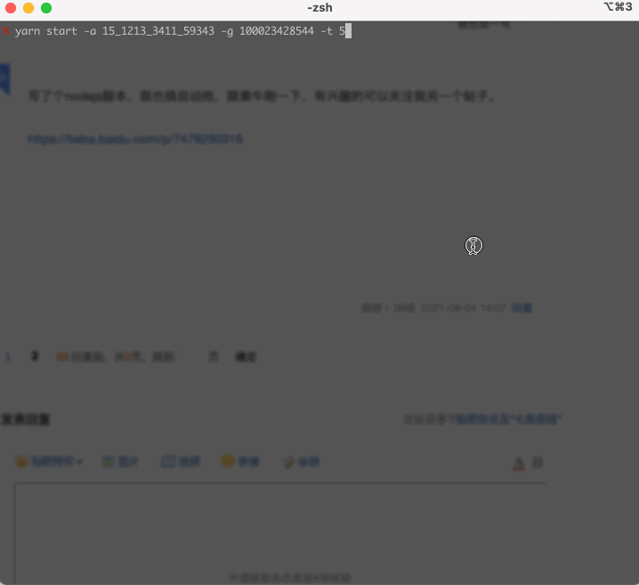

<h1 align="center">JD-HAPPY<h1>

### 前言

代码实现基于[jd-autobuy](https://github.com/Adyzng/jd-autobuy)

最近低价显卡总是被黄牛奸商用脚本扫去，想正常买块卡都不行，实在难受就参考了网上的一些代码，写了个自动下单的脚本。
基本就是输入脚本，扫码登陆，开始监控有没有货，有货就自动下单，24 小时内手机上支付掉就行。

- [x] 扫码登录
- [x] 根据地区查询商品库存
- [x] 库存>0 时自动下单
- [x] 支持抢购商品
- [ ] 支持抢购多个商品
- [ ] 支持下单多个商品
- [ ] 支持缓存登陆状态（仅本地）

```
   在初始化浏览器……
   初始化完成，开始抓取页面
   页面抓取完成，开始分析页面
   页面参数到手，关闭浏览器

   二维码未扫描 ，请扫描二维码
   请手机客户端确认登录
   扫码成功，正在登录
   登录成功

  时间：2021-08-08 15:39:03
  微星（MSI）超龙X GeForce RTX 3070 Ti SUPRIM X 8G  超旗舰 超频版 电竞游戏设计智能学习电脑独立显卡
  价格：5699.00 状态： 34 无货 是否错误：否
  页面链接：http://item.jd.com/100022887988.html
  加购物车链接：http://cart.jd.com/gate.action?pid=100022887988&pcount=1&ptype=1

   开始下单
   下单成功,订单号xxxxx
   请前往京东商城及时付款，以免订单超时取消
```

### 使用

推荐使用 `yarn`

```bash
$ yarn

$ yarn start -a 地区编号 -g 商品编号
# 或
$ yarn start -a 地区编号 -g 商品编号 -f 抢购开始时间
```

<p align="center">

</p>

### 帮助

```bash
$ yarn start

监控库存：

应用方式: yarn start -a 地区编号 -g 商品编号

抢购：

yarn start -a 地区编号 -g 商品编号 -f 抢购开始时间，格式YYYYMMDDHH:mm:ss
抢购模式尽量在临近开抢30秒内再开始使用。

选项：
  --version   显示版本号 [布尔]
  -a, --area  地区编号 [必需]
  -g, --good  商品编号 [必需]
  -t, --time  查询间隔ms [默认值: "15000"]，建议不要低于10000否则会进小黑屋
  -b, --buy   是否下单 [默认值: true]
  -h, --help  显示帮助信息 [布尔]

示例：
  node index.js -a 2_2830_51810_0 -g 5008395

必须的选项：a, g
```
